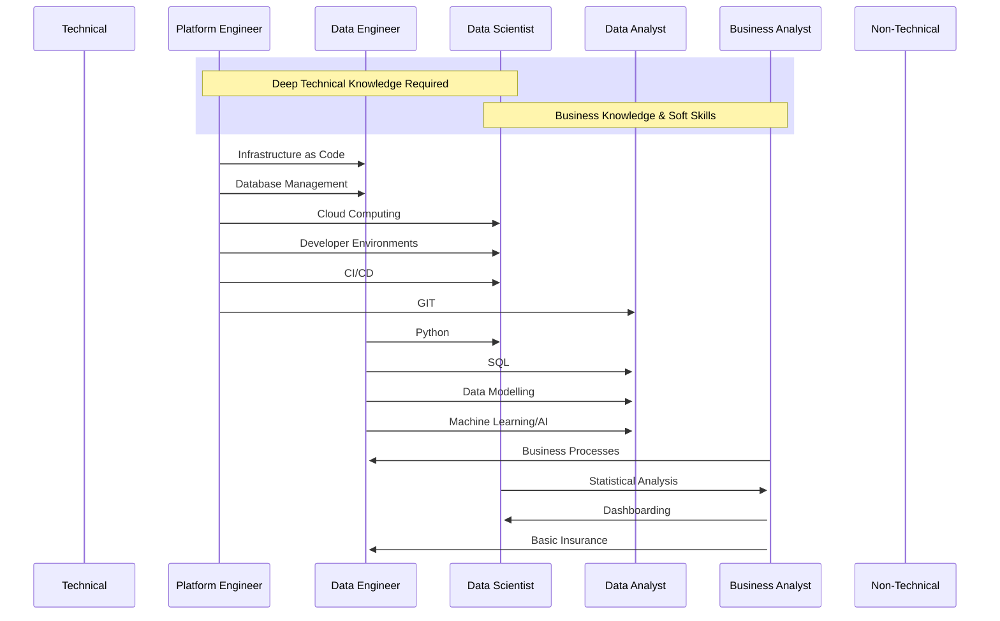

## Knowledge discussion

```mermaid
sequenceDiagram
    participant Technical as Technical
    participant PE as Platform Engineer
    participant DE as Data Engineer
    participant DS as Data Scientist
    participant DA as Data Analyst
    participant BA as Business Analyst
    participant NonTech as Non-Technical

    rect rgb(224, 224, 255)
    note over PE, DS: Deep Technical Knowledge Required
    note over DS, BA: Business Knowledge & Soft Skills
    end

    
    PE->>DE: Infrastructure as Code
    PE->>DE: Database Management
    PE->>DS: Cloud Computing
    PE->>DS: Developer Environments
    PE->>DS: CI/CD
    PE->>DA: GIT
    
    DE->>DS: Python

    DE->>+DA: SQL
    DE->>+DA: Data Modelling
    DE->>+DA: Machine Learning/AI
    BA->>+DE: Business Processes

    DS->>+BA: Statistical Analysis
    BA->>+DS: Dashboarding
    
    BA->>+DE: Basic Insurance
```