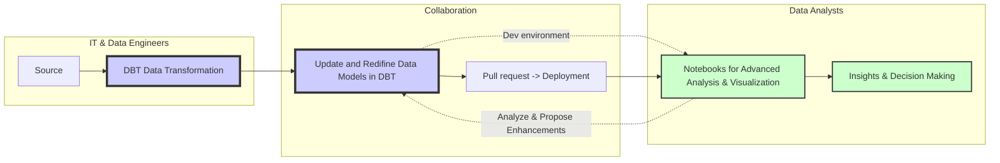

# Proposed Architecture 

The integration of DBT (Data Build Tool), Databricks (including Notebooks and Workflows), GitHub for version control, and associated CI/CD tools presents a powerful combination for modern data analytics and engineering projects. 

This setup is particularly effective due to its strong support for testing, documentation, and collaboration which is a challange for Skuld as today. Together these technologies will create data flows that are transparent and easy to understand for both analysts, management and auditors, and make it easy for IT and Finance to work together on a project. 

Let's explore each technology and its fit within this ecosystem:

## DBT (Data Build Tool)
__Role:__ DBT is used for transforming data in the warehouse by defining data models, performing transformations, and running tests. It's SQL-centric, making it accessible to data analysts who might not be proficient in more complex programming languages.

### Why it Fits:

__Testing:__ DBT supports data testing natively, allowing for the definition and execution of tests on data models to ensure data integrity and accuracy.
__Documentation:__ It automatically generates documentation for the data models it creates, improving understandability and transparency.
__Collaboration:__ DBT projects are easy to version control and share, enhancing collaboration among data teams.
## Databricks (Notebooks and Workflows)
__Role:__ Databricks provides a unified analytics platform. Notebooks are used for data analysis, machine learning, and visualization. Workflows (formerly known as Jobs) automate the execution of these notebooks and other tasks, as well as give a nice overview of the flows.

### Why it Fits:

__Documentation:__ Notebooks support markdown and comments, allowing for rich documentation alongside code. This facilitates knowledge sharing and project documentation.

__Collaboration:__ Notebooks can be shared, commented on, and collaborated on in real-time, supporting an interactive development process.

## DBT + Databricks

- **Shared SQL Expertise**: Enhances understanding and collaboration between teams, allowing for direct communication and iterative development.
- **Minimal competancy requirments**:
    - SQL used everywhere and is requirment regardless of programming language. 
    - Markdown as common way of writing all documentation, all contained within code with a clear handover with a Pull Request in GIT 
- **Clearly defined uses**:
    - Data transformations in SQL
    - Modelling in Notebooks, either R or Python 
- **Empowered Analysts**: 
    - The combined use of SQL and Python in Notebooks allows for a smooth transition from DBT models to analytical exploration.
    - Pre defined environements in Databricks fixes all issues regarding packages and on boarding
    - Analysts can adjust models based on data changes or new insights, leveraging their SQL knowledge for deeper data manipulation and analysis.

- **Databricks Workflow**:
    - Removes manual work, and ensures a specified flow for all models in Skuld
    - Gives a nice overview for management and auditors

## GitHub
__Role:__ GitHub hosts code and supports version control, facilitating code sharing, reviewing, and collaboration.

### Why it Fits:

__Testing:__ Integrates with CI/CD pipelines (via GitHub Actions) to automate tests whenever code is pushed or PRs are created, ensuring code quality and reliability.

__Documentation:__ Supports markdown for project documentation, issue tracking, and wikis for comprehensive project documentation.

__Collaboration:__ PRs, issues, and code reviews foster a collaborative environment where team members can discuss, review, and improve code together.

## CI/CD Tools (GitHub Actions)
__Role:__ Continuous Integration/Continuous Deployment tools automate the testing, building, and deployment of code changes.

### Why it Fits:

__Testing:__ Automates the execution of tests, ensuring that changes do not break existing functionality before merging into the main branch.

__Documentation:__ All changes in DBT will automatically update the [DBT documentation site]() as part of the deployment process. Notebooks can also be included to centralize documentation across Skuld.

__Collaboration:__ CI/CD pipelines enforce code quality standards and facilitate a more structured, reliable development process, enhancing team collaboration.

## Summary -  Integration Benefits
**Unified Workflow:** This combination offers a unified workflow for data processing, from raw data to insights, with robust testing and documentation at each step.

**Quality Assurance:** Automated testing across DBT, Databricks, and GitHub ensures high data quality and system reliability.

**Agility and Speed:** Automation of deployment and testing processes allows teams to move faster while maintaining confidence in their changes.

**Knowledge Sharing:** Integrated documentation practices ensure that knowledge is easily shared and accessible, reducing silos.

**Collaborative Development:** The use of PRs, code reviews, and shared notebooks enhances collaboration, allowing teams to work together more effectively. As well as being a simple way to reduce key person risk. 

In summary, the integration of DBT, Databricks, GitHub, and CI/CD tools creates a cohesive and powerful environment for data teams, balancing the need for agility, quality, and collaboration in modern data projects.

