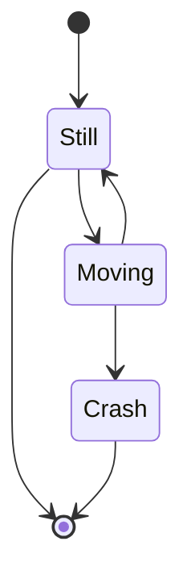

# MkDocs

MkDocs is the package that structures and build a website from our code and files. It may seem a bit overwhelming at first, but it super simple once you try it.

In Risk Analytics all pages are under the "docs" folder and the site can be built by running ```mkdocs serve``` as in the video below in the project folder. 

A good workflow is to have a web browser at one side, and a text editor on the other. By typing mkdocs serve, the site will automatically refresh the page whenever a file is saved which means you get to instantly see what changes is made.

## Calmcode intro

Start by wathcing the first video at [calmcode.io](https://calmcode.io/mkdocs/intro-to-mkdocs.html). 

This takes you through the basics:

- Serve command to build and show the website
- The basic files defining the documentation site

Some of the other movies are also relevant:

- 4.Hosting Images
- 6.Material Mkdocs 
- 9.Extras

In our project the Readme file also is the main page, which gives a consistent documentation on BitBucket, Confluence and at the site. To learn more about this and to write in MarkDown see [calmcode readme](https://calmcode.io/readme-files/contents-and-highlights.html).
 

## RealPython

For Python, docstrings can automatically be rendered into nice documentation pages. Most of this is already configured and will be automatically included. But in order to understand the process RealPython [has a nice walk through](https://realpython.com/python-project-documentation-with-mkdocs/).

This guide takes you all the way from starting a Python project with environment, and all the way to finished documentation site with functions, type hints etc. It also includes some more advanced settings in the configuration file, for instance the Navigation layout that defines the menus on the Risk analytics site.

## Bonus - Mermaid

Mermaid is a plugin that allows us to draw flowcharts as code. This will be rendered in Github and in Mkdocs. As bonus, ChatGPT is good at creating the charts. Just write some mainsteps and you'll have a good starting point.

There are lots of tutorials, both written and on youtube. If you like written the [Mermaid Docs](https://mermaid.js.org/syntax/flowchart.html) have every detail written in a nice format. One can also start testing directly in the [browser with live editor.](https://mermaid.live/edit#pako:eNpdUD1rwzAQ_SvHzTZYbiZtAdNOmdIloOWwLqloLAXnPITg_54TUjDtIdDpffDQe-KYPKPFC0URF0FHglwZ9vCVIRgCXWaaCuVJ-DPNEwnASac9HNphKNydRwkpwrHcBdyD0P0XtrFkGug7s2s7o6eBj85XaUzyw_NmsHQWfZMByBb_N6bKC_idPSFmssa8I0yf3aavbvofAhb6nccGJ9ZvBa9VPLPUoeomdmh19Xym5SoOXVxVSouk4yOOaGVeuMHllnupRRVwfQFjKGVL).

If you prefer [YouTube this guide](https://www.youtube.com/watch?v=JiQmpA474BY) takes you through everything. The following code shows an example flow:


__Raw code:__
```bash
stateDiagram-v2
    [*] --> Still
    Still --> [*]
    Still --> Moving
    Moving --> Still
    Moving --> Crash
    Crash --> [*]
```